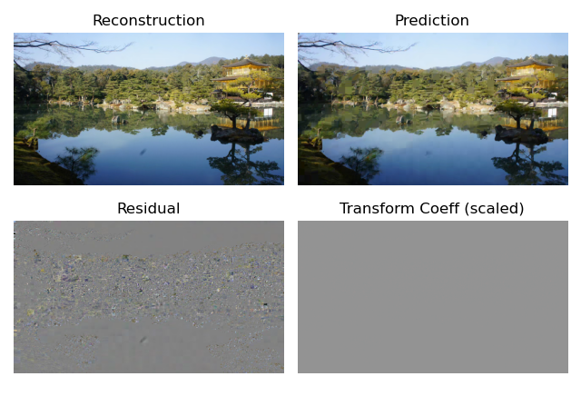

# PyDe265
Python bindings for [Libde265](https://github.com/strukturag/libde265), 
specifically [Christian Feldmann](https://github.com/ChristianFeldmann)'s
 [version](https://github.com/ChristianFeldmann/libde265/tree/v1.1/libde265),
  which provides better access to H265's internal image representation.
  
## Capabilities

- Decode h265 streams from python
- Available Signals
  - Reconstruction
  - Prediction
  - Residual
  - Transform Coefficients
- Available Structure Elements
  - CTB: Slice Indices
  - CB: Size, Prediction Block Partitioning, Prediction mode, PCM Flag, TQBypass Flag
  - PB: Size, POC0/1 ref. frame indices & motion vectors
  - TB: Depth (size), Intra (or not), Intra Y and CbCr directions
  
The processing of H265's structural elements is based on [YUView](https://github.com/IENT/YUView).
 
## Usage

Take a look at the examples folder or run the signals example directly:

`LD_LIBRARY_PATH="/path_to_libde265/build/libde265:$LD_LIBRARY_PATH python examples/signals.py"`

This will show you the different output signals:

 
## Installation

1. Build libde265.so
    1. Download v1.1: `wget https://github.com/ChristianFeldmann/libde265/archive/v1.1.zip`
    2. Build it: `mkdir build & cd build & cmake .. & make`
    3. Assert that `libde265.so` is in `build/libde265`
2. Install PyDe265
    1. Clone this repo: `git clone https://github.com/kloppjp/pyde265`
    2. Install the package: `cd pyde265 & pip install . --install-option="--libde265_path=/path_to_libde265/build/libde265"`
    
The `--install-option` argument is necessary to tell `pip` where to find the library.

Note that the library is a _shared_ object, meaning it isn't linked into the package.
Hence, if libde265.so is not on your `LD_LIBRARY_PATH` you need to add it when running
a python script: `LD_LIBRARY_PATH=/path_to_libde265/build/libde265 python my_script.py`.
    